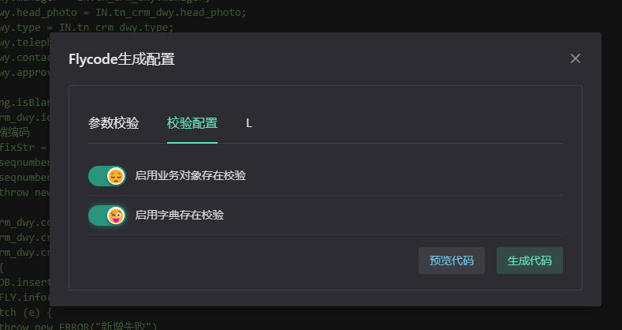

# Flycode 代码生成器 (摸鱼)

1. 浏览器安装油猴插件 [安装教程](https://juejin.cn/post/7000726775453974558)
2. [点击这里安装](https://ghproxy.com/?q=https%3A%2F%2Fraw.githubusercontent.com%2FDwsy%2FFlyCodeGenerator%2Fmain%2Fflycodegenerator.user.js)Flycode 代码生成器

---

::: tip
第一版，功能不太完善，生成后的代码并不能直接使用建议酌情修改 😄

代码生成功能强依托与实体的类型，创建时需要正确填写。

保存领域时如果保存时间成功消息弹出太慢建议保存后刷新页面或者再次保存，因为插件协议数据是通过请求获取的而不是`monaco`编辑器中的数据

> IDE更新到5.10版本打包方式更改，monaco全局变量无法调用所以手动设置全局变量暴露并反向代理了IDE网站
> 反向代理版本IDE URL:http://xwide.dwsy.link/
> :::

### 功能介绍

1. 列表查询 FlyQuery

创建领域后配置输入与输出然后保存点击 生成 SQL 按钮即可

2. 新增编辑

创建领域后配置输入即可 点击生成 Flycode 按钮后可配置那些参数需要校验以及是否必填，在`校验配置中还可以选择是否校验字典与业务对象是否存在`

3. Excel 导入

创建领域操作类型选择`导入`配置`输入`后保存点击生成 Flycode 然后上传 Excel 模版文件，选择表后会自动映射导入关系以及根据`业务对象`啥啥值以及字典对象值反查 ID，
还可以进行必填校验，这个功能自动完成功能依靠 Execl 表中第二行的备注是否有`必填`与`非必填`

4. Excel 导出

创建领域操作类型选择`导出`配置`输入`后配置映射关系即可

5. 主题切换以及去除彩虹括号
