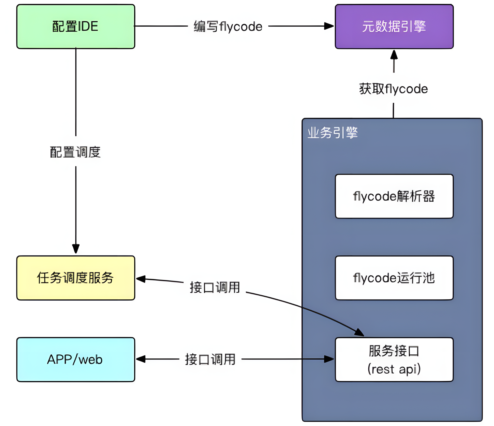

# 1. 简介
## 1.1. 什么是flycode
flycode 是⼀种采⽤javascript语法，并可以结合sql语法进⾏数据查询的语⾔。
产品开发⼈员或者项⽬实施⼈员，使⽤flycode仅需要编写业务相关逻辑。业务引擎会发布相应的服务
接⼝，并⾃动处理多租户隔离、数据离线、数据追踪、数据权限、分⻚、排序等平台逻辑。
flycode 除了可以使⽤ es5标准 的javascript内置函数， 还提供了⼀些常⽤操作API，如:⽇期，会话，
输⼊输出上下⽂，数据库操作等；平台服务API，如:excel导⼊导出，发送消息等。
建议在编写flycode时，不要使⽤复杂的js技巧。flycode代码尽量表达当前业务领域内的逻辑，以便
于维护。
## 1.2. 何时需要flycode
需要实现业务逻辑，并发布rest接⼝时，flycode。
需要实现业务逻辑，并发布重⽤函数时，flycode。
需要实现各种数据迁移（如导⼊导出excel）时，flycode。
需要在逻辑中调⽤平台服务(如发送消息，流程处理)时，flycode。
## 1.3. flycode如何运⾏


如上图所示:
---
`业务操作`
1. 产品开发或项⽬实施⼈员 使⽤ 配置IDE 编写flycode，将被存⼊ 元数据引擎。
2. ⽤户 登录 app或web浏览器，app或浏览器会调⽤ 业务引擎 接⼝，业务引擎则会从元数据引
擎获取flycode解析并运⾏，并返回结果。
---
`任务调度`
1. 产品开发或项⽬实施⼈员 使⽤ 配置IDE 编写flycode，并配置任务调度，将被存⼊ 元数据引
擎。
2. 任务调度服务 达到触发条件时，触发请求接⼝，异步执⾏flycode。
---

# 2. 第⼀⾏代码
以下示例中，将演示flycode的重要特点 —— js语法与sql语法相结合的数据查询操作，我们把这种语句称为FlyQL(flycode查询语⾔)。

示例场景说明：
假设已经建⽴了业务对象 ⻔店(kx_store)，并且有 ID(storeid)和 ⻔店名称(storename)的属性。
编写业务逻辑: `获取ID为1的⻔店，将⻔店名称修改为“示例⻔店1”，后保存。`

```js
// 查询⻔店表，获得ID为1的⻔店
var temp = SELECT storeid, storename FROM kx_store WHERE storeid = 1;
FLY.log(temp)
// 修改⻔店名称
temp[0].storename = '示例⻔店1';
//
// 保存
DB.save(temp[0]);
```

