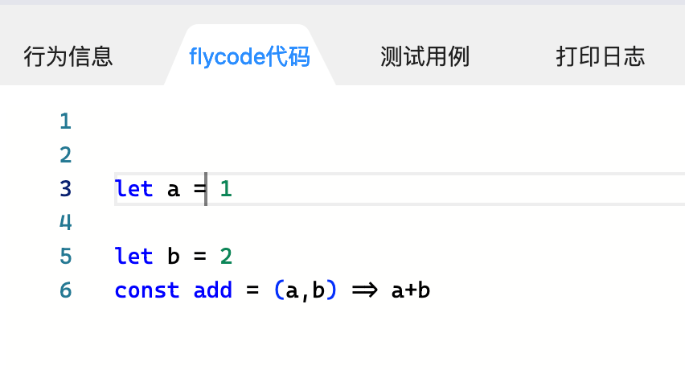
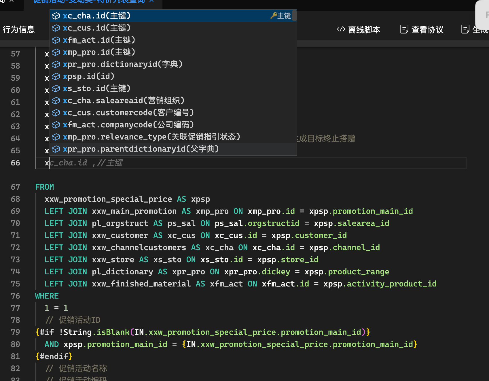
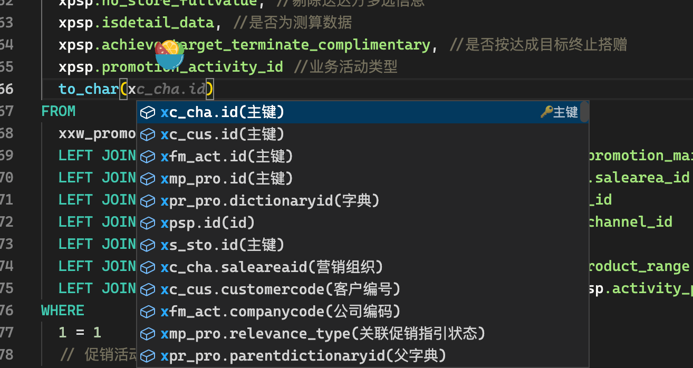
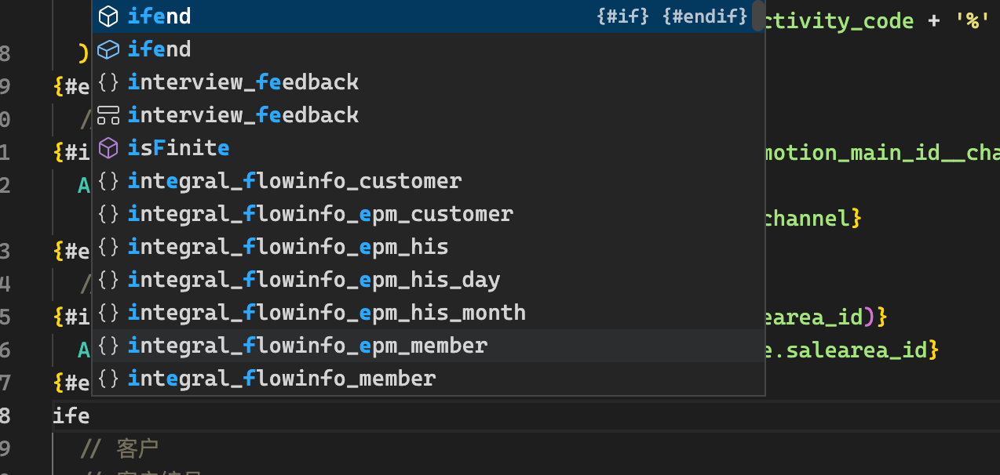
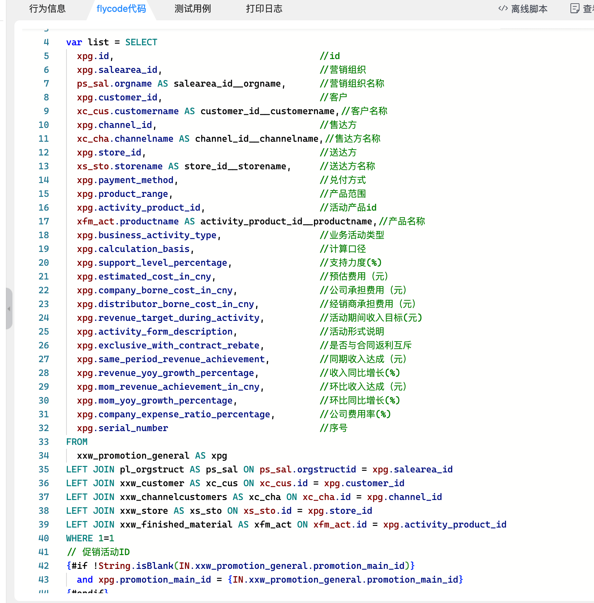
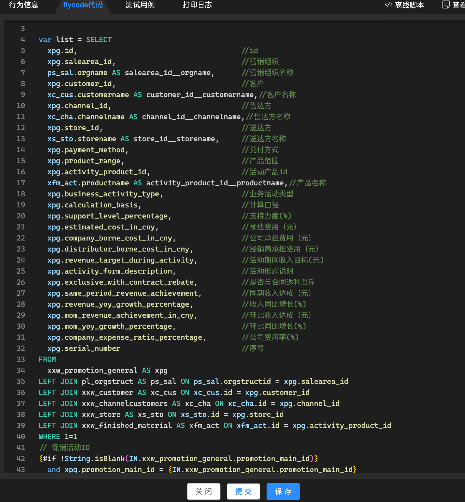
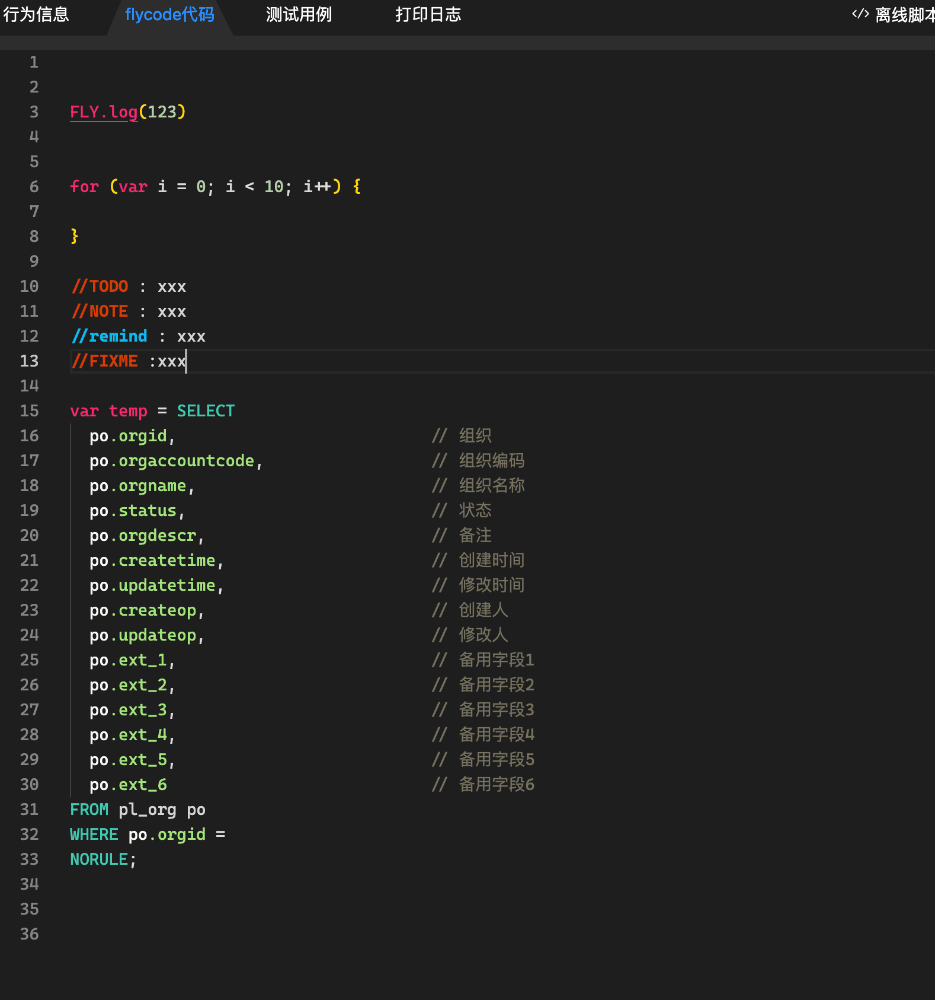

# FlyCodeGenerator 2.1 Released 🚀

[flycodegenerator2.0](./flycodegenerator2.md)

## 更新日志

1.使用 pretty 进行代码格式化 2.使用 babel 对高版本 es 语法进行降级 支持 es2017

 3.支持 SQL 列查询代码提示

from 语句前自动补全逗号与注释后与函数调用只补全字段
 4.添加了一堆代码片段
如 for if fori foin foof
常用的如 ifend join 啥的
 3.移植了 vscode 默认主题

 4.添加了 Monokai 暗黑模式主题

