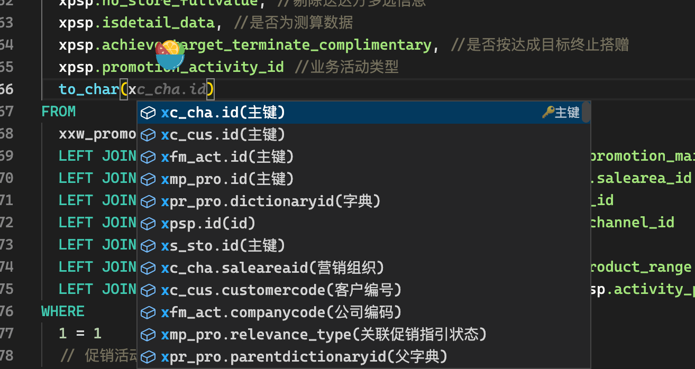
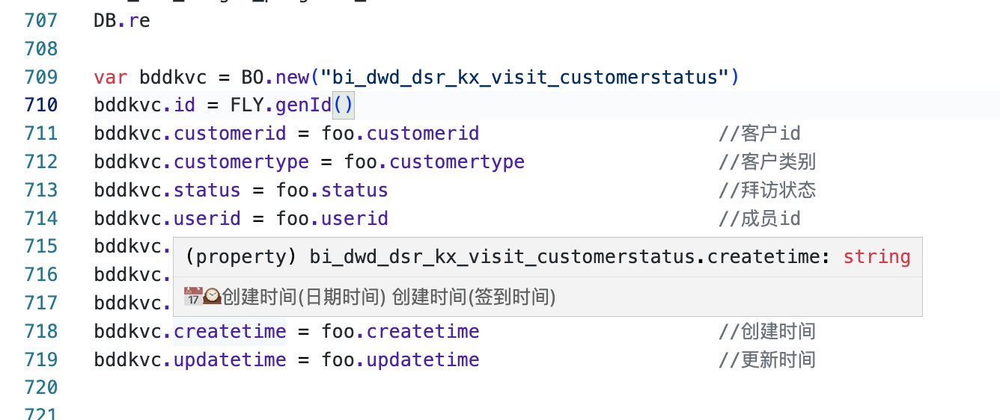

# This repository has been archived by the owner on Jan 9, 2024. It is now read-only.

> https://github.com/Dwsy/FlyCodeGenerator/

# FlyCodeGenerator 版本日志

## FlyCodeGenerator 2.2 Released 🚀

### 更新日志

1. 新增侧边代码编辑功能,代码行数多的时候比较好用。
   

2. 新增代码大纲功能,代码行数多的时候比较好用。


> 因为 IDE 在关闭邻域的时候未规范删除 monaco editor 对象所以每个邻域仅第一次打开的时候显示，关闭在打开无法显示

## FlyCodeGenerator 2.1 Released 🚀

### 更新日志

1.使用 pretty 进行代码格式化 2.使用 babel 对高版本 es 语法进行降级 支持 es2017

 3.支持 SQL 列查询代码提示

from 语句前自动补全逗号与注释后与函数调用只补全字段
 4.添加了一堆代码片段
如 for if fori foin foof
常用的如 ifend join 啥的
 3.移植了 vscode 默认主题

 4.添加了 Monokai 暗黑模式主题


> 2.0 版本代码生成器主要针对稳定性做了一些优化，以及增加了一些快速生成代码的功能。

## FlyCodeGenerator 2.0 Released 🚀

Github Link
[FlyCodeGenerator 2.0](github.com/dwsy/flycodegenerator)

## 介绍

`FlyCodeGenerator` 是一款基于[`vite-plugin-monkey`](https://github.com/lisonge/vite-plugin-monkey)开发的一款专用于增强玄武 aPaaS Ide 的插件。

---

## 主要功能

1.有根据协议快速生成`增删改查`代码。

2.快速生成 Excel 导入导出代码可根据模版自动反查`实体`以及进行`校验`操作。

3.增强 IDE 代码补全功能，包括 API，实体，出入参等。

4.快速生成实体查询代码与 new BO，for 循环等。

5.支持对 flyquery SQL 代码 进行`正确的格式化`。

6.自定义 IDE 主题，增强编辑器对 JS 代码的`高亮`功能。

## 注意

::: tip

> 1.0 版本使用油猴加载，2.0 可以独立运行，but 因为 IDE5.1 版本关闭了 monaco 的 global api 所以针对 IDE 做了一些需要使用我的反向代理网址
> [点击这里打开](http://xwide.dwsy.link/#/login) 已内置插件无需安装油猴版本

油猴插件版本菜单可以在油猴中配置功能开关

内置版本鼠标滑到右下角显示

:::

## 功能演示

### 1.快速生成增删改查代码

#### 1. 列表查询

新增领域后选择操作类型为`列表查询`选择输入输出实体后重新打开领域，点击`生成`按钮即可。

生成的代码会根据入参进行筛选以及出参中关联的实体进行连表查询。

::: details 点击查看生成的代码

```js
SELECT
  tcd.id,  //终端ID
  tcd.code,  //终端编码
  tcd.marketing_region,  //终端所属营销区域
  ps_mar.fullname as marketing_region__fullname,  //name路径
  tcd.channel_type,  //渠道类型
  tcd.level,  //终端级别
  tcd.contact_name,  //联系人姓名
  tcd.telephone_number,  //联系人电话
  tcd.detailed_addresses,  //详细地址
  tcd.administrative_region,  //行政区域
  pr_adm.regionname as administrative_region__regionname,  //行政区域名称
  pr_adm.namepath as administrative_region__namepath,  //区域名称路径
  tcd.manager,  //终端负责人
  m_man.orgname as manager__orgname,  //成员姓名
  tcd.head_photo,  //头门照片
  tcd.create_time,  //创建时间
  tcd.update_time,  //修改时间
  tcd.name,  //终端名称
  tcd.type,  //终端类型
  ks_typ.dicvalue as type__dicvalue,  //字典值
  tcd.created_user,  //创建人
  tcd.approval_status  //审批状态
FROM
  tn_crm_dwy as tcd
LEFT JOIN pl_orgstruct as ps_mar ON ps_mar.orgstructid = tcd.marketing_region
LEFT JOIN pl_region as pr_adm ON pr_adm.regionid = tcd.administrative_region
LEFT JOIN pl_orgstruct as m_man ON m_man.orgstructid = tcd.manager
LEFT JOIN pl_dictionary as ks_typ ON ks_typ.dickey = tcd.type
WHERE 1=1
// 终端编码
{#if !String.isBlank(IN.tn_crm_dwy.code)}
  and tcd.code LIKE { '%' + {IN.tn_crm_dwy.code} + '%' }
{#endif}
// 终端所属营销区域
{#if !String.isBlank(IN.tn_crm_dwy.marketing_region)}
  and tcd.marketing_region = {IN.tn_crm_dwy.marketing_region}
{#endif}
// code路径
{#if !String.isBlank(IN.tn_crm_dwy.marketing_region__codepath)}
  and tcd.marketing_region__codepath = {IN.tn_crm_dwy.marketing_region__codepath}
{#endif}
// 渠道类型
{#if !String.isBlank(IN.tn_crm_dwy.channel_type)}
  and tcd.channel_type = {IN.tn_crm_dwy.channel_type}
{#endif}
// 字典值
{#if !String.isBlank(IN.tn_crm_dwy.channel_type__dicvalue)}
  and tcd.channel_type__dicvalue LIKE { '%' + {IN.tn_crm_dwy.channel_type__dicvalue} + '%' }
{#endif}
// 终端级别
{#if !String.isBlank(IN.tn_crm_dwy.level)}
  and tcd.level = {IN.tn_crm_dwy.level}
{#endif}
// 字典值
{#if !String.isBlank(IN.tn_crm_dwy.level__dicvalue)}
  and tcd.level__dicvalue LIKE { '%' + {IN.tn_crm_dwy.level__dicvalue} + '%' }
{#endif}
// 行政区域
{#if !String.isBlank(IN.tn_crm_dwy.administrative_region)}
  and tcd.administrative_region = {IN.tn_crm_dwy.administrative_region}
{#endif}
// code路径编码
{#if !String.isBlank(IN.tn_crm_dwy.administrative_region__codepath)}
  and tcd.administrative_region__codepath LIKE { '%' + {IN.tn_crm_dwy.administrative_region__codepath} + '%' }
{#endif}
// 终端负责人
{#if !String.isBlank(IN.tn_crm_dwy.manager)}
  and tcd.manager = {IN.tn_crm_dwy.manager}
{#endif}
// 成员姓名
{#if !String.isBlank(IN.tn_crm_dwy.manager__orgname)}
  and tcd.manager__orgname LIKE { '%' + {IN.tn_crm_dwy.manager__orgname} + '%' }
{#endif}
// 头门照片
{#if !String.isBlank(IN.tn_crm_dwy.head_photo)}
  and tcd.head_photo = {IN.tn_crm_dwy.head_photo}
{#endif}
// 创建时间
{#if !String.isBlank(min) && !String.isBlank(max)}
  and IN.tn_crm_dwy.create_time BETWEEN { min } AND { max }
{#endif}
// 终端名称
{#if !String.isBlank(IN.tn_crm_dwy.name)}
  and tcd.name LIKE { '%' + {IN.tn_crm_dwy.name} + '%' }
{#endif}
// 终端类型
{#if !String.isBlank(IN.tn_crm_dwy.type)}
  and tcd.type = {IN.tn_crm_dwy.type}
{#endif}
// 审批状态
{#if !String.isBlank(IN.tn_crm_dwy.approval_status)}
  and tcd.approval_status = {IN.tn_crm_dwy.approval_status}
{#endif}
// 按日查询
{#if !String.isBlank(min) && !String.isBlank(max)}
  and IN.tn_crm_dwy.query_by_day BETWEEN { min } AND { max }
{#endif}
// 按周查询
{#if !String.isBlank(min) && !String.isBlank(max)}
  and IN.tn_crm_dwy.query_by_week BETWEEN { min } AND { max }
{#endif}
// 按月查询
{#if !String.isBlank(min) && !String.isBlank(max)}
  and IN.tn_crm_dwy.query_by_month BETWEEN { min } AND { max }
{#endif}
// 按时间范围查询开始
{#if !String.isBlank(IN.tn_crm_dwy.query_by_range)}
  and tcd.query_by_range = {IN.tn_crm_dwy.query_by_range}
{#endif}
 NORULE;
```

:::

#### 2. 新增/编辑

新增领域后选择操作类型为`数据提交`选择输入实体后重新打开领域，即可生成代码。


::: details 点击查看生成的代码

```js
var errMsg = "";
var validateFail = false;

(function main() {
    validation()

    var isInsert = isInsertFunc()

    if (isInsert) {
        insert()
    } else {
        update()
    }


})()


/**
 * 判断是否为插入操作
 * @returns {boolean}
 */
function isInsertFunc() {
    var isInsert = false
    if (String.isBlank(IN.tn_crm_dwy.id)) {
        isInsert = true
    }
    return isInsert
}
/**
* 插入函数
*/
function insert() {
    var id = FLY.genId();
    IN.tn_crm_dwy.id = id;

    DB.insert(IN.tn_crm_dwy);
}

/**
* 更新验函数
*/
function update() {
    var temp = select * from tn_crm_dwy where id = { IN.tn_crm_dwy.id } NORULE;
    if (temp.length == 0){
        throw new ERROR("待更新数据不存在")
    }
    var tcd = IN.tn_crm_dwy
    var tn_crm_dwy = temp[0]
    // 终端ID
    tn_crm_dwy.id = tcd.id
    // 终端编码
    tn_crm_dwy.code = tcd.code
    // 终端所属营销区域
    tn_crm_dwy.marketing_region = tcd.marketing_region
    // 渠道类型
    tn_crm_dwy.channel_type = tcd.channel_type
    // 终端级别
    tn_crm_dwy.level = tcd.level
    // 联系人姓名
    tn_crm_dwy.contact_name = tcd.contact_name
    // 联系人电话
    tn_crm_dwy.telephone_number = tcd.telephone_number
    // 详细地址
    tn_crm_dwy.detailed_addresses = tcd.detailed_addresses
    // 行政区域
    tn_crm_dwy.administrative_region = tcd.administrative_region
    // 终端负责人
    tn_crm_dwy.manager = tcd.manager
    // 头门照片
    tn_crm_dwy.head_photo = tcd.head_photo
    // 终端名称
    tn_crm_dwy.name = tcd.name
    // 终端类型
    tn_crm_dwy.type = tcd.type
    DB.update(tn_crm_dwy);
}

/**
* 统一校验函数
*/
function validation() {
    var tcd = IN.tn_crm_dwy
    // 校验终端编码
    validateCode(tcd.code)
    // 校验终端所属营销区域
    validateMarketingRegion(tcd.marketing_region)
    // 校验渠道类型
    validateChannelType(tcd.channel_type)
    // 校验终端级别
    validateLevel(tcd.level)
    // 校验联系人姓名
    validateContactName(tcd.contact_name)
    // 校验行政区域
    validateAdministrativeRegion(tcd.administrative_region)
    // 校验终端负责人
    validateManager(tcd.manager)
    // 校验终端名称
    validateName(tcd.name)
    // 校验终端类型
    validateType(tcd.type)
    if (validateFail) {
        throw new ERROR(errMsg);
    }
}

/**
* 校验终端编码函数
*/
function validateCode(code) {
    var validationFailed = false
    var validateErrMsg = "校验终端编码失败"
    /* Write your ValidateLogicCode */

    if (validationFailed) {
        appendErrmsg(validateErrMsg);
    }
}

/**
* 校验终端所属营销区域函数
*/
function validateMarketingRegion(marketing_region) {
    var validationFailed = false
    var validateErrMsg = "校验终端所属营销区域失败"
    /* Write your ValidateLogicCode */

    if (validationFailed) {
        appendErrmsg(validateErrMsg);
    }
}

/**
* 校验渠道类型函数
*/
function validateChannelType(channel_type) {
    var validationFailed = false
    var validateErrMsg = "校验渠道类型失败"
    /* Write your ValidateLogicCode */

    if (validationFailed) {
        appendErrmsg(validateErrMsg);
    }
}

/**
* 校验终端级别函数
*/
function validateLevel(level) {
    var validationFailed = false
    var validateErrMsg = "校验终端级别失败"
    /* Write your ValidateLogicCode */

    if (validationFailed) {
        appendErrmsg(validateErrMsg);
    }
}

/**
* 校验联系人姓名函数
*/
function validateContactName(contact_name) {
    var validationFailed = false
    var validateErrMsg = "校验联系人姓名失败"
    /* Write your ValidateLogicCode */

    if (validationFailed) {
        appendErrmsg(validateErrMsg);
    }
}

/**
* 校验联系人电话函数
*/
function validateTelephoneNumber(telephone_number) {
    var validationFailed = false
    var validateErrMsg = 联系电话格式有误  var phoneReg = /^1[3456789]d{9}$/;
  if (!phoneReg.test(phoneNumber)) { //联系电话正则校验
    validationFailed = true
  }
    if (validationFailed) {
        appendErrmsg(validateErrMsg);
    }
}

/**
* 校验行政区域函数
*/
function validateAdministrativeRegion(administrative_region) {
    var validationFailed = false
    var validateErrMsg = "校验行政区域失败"
    /* Write your ValidateLogicCode */

    if (validationFailed) {
        appendErrmsg(validateErrMsg);
    }
}

/**
* 校验终端负责人函数
*/
function validateManager(manager) {
    var validationFailed = false
    var validateErrMsg = "校验终端负责人失败"
    /* Write your ValidateLogicCode */

    if (validationFailed) {
        appendErrmsg(validateErrMsg);
    }
}

/**
* 校验终端名称函数
*/
function validateName(name) {
    var validationFailed = false
    var validateErrMsg = "校验终端名称失败"
    /* Write your ValidateLogicCode */

    if (validationFailed) {
        appendErrmsg(validateErrMsg);
    }
}

/**
* 校验终端类型函数
*/
function validateType(type) {
    var validationFailed = false
    var validateErrMsg = "校验终端类型失败"
    /* Write your ValidateLogicCode */

    if (validationFailed) {
        appendErrmsg(validateErrMsg);
    }
}

/**
* 将错误信息添加到全局错误消息中。
* @param {string} message - 要添加的错误消息。
*/
function appendErrmsg(message) {
    errMsg += message
    validateFail = true
}
/**
* 验证字典是否存在
* @param {number} dictionaryid - 字典 ID
* @param {string} dictName - 字典名称
* @returns {void}
*/
function validateDictidExist(dictionaryid, dictName) {
    var temp = select count(*) from pl_dictionary where dictionaryid = { dictionaryid } NORULE;
    if (temp[0].count == 0) {
        appendErrmsg("字典" + dictName + "不存在；")
    }
}
```

:::

### 2. 快速生成 Excel 导入导出代码

#### 1. Flycode 导出功能

新增领域后选择操作类型为`导出`选择输入实体输出后重新打开领域，即可生成代码。
::: details 点击查看生成的代码

```js

var _xlscolBind = [
    {
        "field": "id",
        "column": "id"
    },
    {
        "field": "promotion_main_id",
        "column": "促销活动ID"
    },
    {
        "field": "promotion_main_id__activity_name",
        "column": "促销活动名称"
    },
    {
        "field": "promotion_main_id__activity_code",
        "column": "促销活动编码"
    },
    {
        "field": "group_code",
        "column": "组号"
    },
    {
        "field": "salearea_id",
        "column": "营销组织"
    },
    {
        "field": "salearea_id__orgname",
        "column": "营销组织名称"
    },
    {
        "field": "customer_id",
        "column": "客户"
    },
    {
        "field": "customer_id__customername",
        "column": "客户名称"
    },
    {
        "field": "channel_id",
        "column": "售达方"
    },
    {
        "field": "channel_id__channelname",
        "column": "售达方名称"
    },
    {
        "field": "store_id",
        "column": "送达方"
    },
    {
        "field": "store_id__storename",
        "column": "送达方名称"
    },
    {
        "field": "no_store_fullvalue",
        "column": "剔除送达方"
    },
    {
        "field": "store_quantity",
        "column": "送达方数量"
    },
    {
        "field": "activity_execution_cycle_start",
        "column": "活动执行周期（变价周期）开始"
    },
    {
        "field": "activity_execution_cycle_end",
        "column": "活动执行周期（变价周期）结束"
    },
    {
        "field": "terminal_execution_cycle_start",
        "column": "终端执行周期（市场检核）开始"
    },
    {
        "field": "terminal_execution_cycle_end",
        "column": "终端执行周期（市场检核）结束"
    },
    {
        "field": "business_activity_type_description",
        "column": "业务活动类型-C端活动说明"
    },
    {
        "field": "payment_method",
        "column": "兑付方式"
    },
    {
        "field": "product_range",
        "column": "产品范围"
    },
    {
        "field": "activity_product_id",
        "column": "活动产品id"
    },
    {
        "field": "activity_product_id__productname",
        "column": "产品名称"
    },
    {
        "field": "activity_product_code",
        "column": "活动产品物料编码"
    },
    {
        "field": "execution_method",
        "column": "执行方式"
    },
    {
        "field": "min_quantity_for_gift",
        "column": "赠送条件≥X件起送（最小值）"
    },
    {
        "field": "max_quantity_for_gift",
        "column": "赠送条件≥X件起送（最大值）"
    },
    {
        "field": "original_supply_price",
        "column": "原供价"
    },
    {
        "field": "guided_supply_price",
        "column": "指引供价"
    },
    {
        "field": "activity_supply_price_in_cny",
        "column": "活动供价（元）"
    },
    {
        "field": "original_selling_price",
        "column": "原售价"
    },
    {
        "field": "guided_selling_price",
        "column": "指引售价"
    },
    {
        "field": "activity_selling_price_in_cny",
        "column": "活动售价（元）"
    },
    {
        "field": "sales_unit",
        "column": "销售单位"
    },
    {
        "field": "exclusive_with_contract_rebate",
        "column": "是否与合同返利互斥"
    },
    {
        "field": "start_date",
        "column": "活动开始时间"
    },
    {
        "field": "end_date",
        "column": "活动结束时间"
    },
    {
        "field": "company_discount_rate",
        "column": "公司折扣率"
    },
    {
        "field": "original_front_margin_of_store",
        "column": "卖场原前台毛利"
    },
    {
        "field": "promotional_front_margin_of_store",
        "column": "卖场活动前台毛利"
    },
    {
        "field": "current_pre_discount_revenue_in_cny",
        "column": "本期折前收入（元）"
    },
    {
        "field": "discounted_revenue_target",
        "column": "本期收入目标折后（元）"
    },
    {
        "field": "discounted_same_period_revenue_achievement",
        "column": "同期收入达成折后（元）"
    },
    {
        "field": "revenue_yoy_growth",
        "column": "收入同比增长"
    },
    {
        "field": "current_sales_target",
        "column": "本期销量目标"
    },
    {
        "field": "same_period_sales_achievement",
        "column": "同期销量达成"
    },
    {
        "field": "sales_yoy_growth",
        "column": "销量同比增长"
    },
    {
        "field": "discount_expense_amount",
        "column": "本期折扣费用金额（元）"
    },
    {
        "field": "company_expense_ratio",
        "column": "公司费用率"
    },
    {
        "field": "gross_margin_ratio",
        "column": "毛利率"
    },
    {
        "field": "createtime",
        "column": "创建时间"
    },
    {
        "field": "createop",
        "column": "创建人"
    },
    {
        "field": "updatetime",
        "column": "更新时间"
    },
    {
        "field": "updateop",
        "column": "更新人"
    },
    {
        "field": "serial_number",
        "column": "序号"
    }

]


var list =
SELECT
  xpsp.id,  //id
  xpsp.promotion_main_id,  //促销活动ID
  xmp_pro.activity_name as promotion_main_id__activity_name,  //促销活动名称
  xmp_pro.activity_code as promotion_main_id__activity_code,  //促销活动编码
  xpsp.salearea_id,  //营销组织
  ps_sal.orgname as salearea_id__orgname,  //营销组织名称
  xpsp.customer_id,  //客户
  xc_cus.customername as customer_id__customername,  //客户名称
  xpsp.channel_id,  //售达方
  xc_cha.channelname as channel_id__channelname,  //售达方名称
  xpsp.store_id,  //送达方
  xs_sto.storename as store_id__storename,  //送达方名称
  xpsp.no_store_ids,  //剔除送达方
  xpsp.store_quantity,  //送达方数量
  xpsp.activity_execution_cycle_start,  //活动执行周期（变价周期）开始
  xpsp.activity_execution_cycle_end,  //活动执行周期（变价周期）结束
  xpsp.terminal_execution_cycle_start,  //终端执行周期（市场检核）开始
  xpsp.terminal_execution_cycle_end,  //终端执行周期（市场检核）结束
  xpsp.business_activity_type_description,  //业务活动类型-C端活动说明
  xpsp.payment_method,  //兑付方式
  xpsp.product_range,  //产品范围
  xpsp.activity_product_id,  //活动产品id
  xfm_act.productname as activity_product_id__productname,  //产品名称
  xpsp.activity_product_code,  //活动产品物料编码
  xpsp.execution_method,  //执行方式
  xpsp.min_quantity_for_gift,  //赠送条件≥X件起送（最小值）
  xpsp.max_quantity_for_gift,  //赠送条件≥X件起送（最大值）
  xpsp.original_supply_price,  //原供价
  xpsp.guided_supply_price,  //指引供价
  xpsp.activity_supply_price_in_cny,  //活动供价（元）
  xpsp.original_selling_price,  //原售价
  xpsp.guided_selling_price,  //指引售价
  xpsp.activity_selling_price_in_cny,  //活动售价（元）
  xpsp.sales_unit,  //销售单位
  xpsp.exclusive_with_contract_rebate,  //是否与合同返利互斥
  xpsp.start_date,  //活动开始时间
  xpsp.end_date,  //活动结束时间
  xpsp.company_discount_rate,  //公司折扣率
  xpsp.original_front_margin_of_store,  //卖场原前台毛利
  xpsp.promotional_front_margin_of_store,  //卖场活动前台毛利
  xpsp.current_pre_discount_revenue_in_cny,  //本期折前收入（元）
  xpsp.discounted_revenue_target,  //本期收入目标折后（元）
  xpsp.discounted_same_period_revenue_achievement,  //同期收入达成折后（元）
  xpsp.revenue_yoy_growth,  //收入同比增长
  xpsp.current_sales_target,  //本期销量目标
  xpsp.same_period_sales_achievement,  //同期销量达成
  xpsp.sales_yoy_growth,  //销量同比增长
  xpsp.discount_expense_amount,  //本期折扣费用金额（元）
  xpsp.company_expense_ratio,  //公司费用率
  xpsp.gross_margin_ratio,  //毛利率
  xpsp.createtime,  //创建时间
  xpsp.createop,  //创建人
  xpsp.updatetime,  //更新时间
  xpsp.updateop,  //更新人
  xpsp.serial_number,  //序号
  xpsp.group_code,  //组号
  xpsp.no_store_fullvalue,  //剔除送达方多选信息
  xpsp.isdetail_data  //是否为测算数据
FROM
  xxw_promotion_special_price as xpsp
LEFT JOIN xxw_main_promotion as xmp_pro ON xmp_pro.id = xpsp.promotion_main_id
LEFT JOIN pl_orgstruct as ps_sal ON ps_sal.orgstructid = xpsp.salearea_id
LEFT JOIN xxw_customer as xc_cus ON xc_cus.id = xpsp.customer_id
LEFT JOIN xxw_channelcustomers as xc_cha ON xc_cha.id = xpsp.channel_id
LEFT JOIN xxw_store as xs_sto ON xs_sto.id = xpsp.store_id
LEFT JOIN xxw_finished_material as xfm_act ON xfm_act.id = xpsp.activity_product_id
WHERE 1=1
// 促销活动ID
{#if !String.isBlank(IN.xxw_promotion_special_price.promotion_main_id)}
  and xpsp.promotion_main_id = {IN.xxw_promotion_special_price.promotion_main_id}
{#endif}
// 营销组织
{#if !String.isBlank(IN.xxw_promotion_special_price.salearea_id)}
  and xpsp.salearea_id = {IN.xxw_promotion_special_price.salearea_id}
{#endif}
// 客户
{#if !String.isBlank(IN.xxw_promotion_special_price.customer_id)}
  and xpsp.customer_id = {IN.xxw_promotion_special_price.customer_id}
{#endif}
// 客户名称
{#if !String.isBlank(IN.xxw_promotion_special_price.customer_id__customername)}
  and xpsp.customer_id__customername LIKE { '%' + {IN.xxw_promotion_special_price.customer_id__customername} + '%' }
{#endif}
// 售达方
{#if !String.isBlank(IN.xxw_promotion_special_price.channel_id)}
  and xpsp.channel_id = {IN.xxw_promotion_special_price.channel_id}
{#endif}
// 售达方名称
{#if !String.isBlank(IN.xxw_promotion_special_price.channel_id__channelname)}
  and xpsp.channel_id__channelname LIKE { '%' + {IN.xxw_promotion_special_price.channel_id__channelname} + '%' }
{#endif}
// 送达方
{#if !String.isBlank(IN.xxw_promotion_special_price.store_id)}
  and xpsp.store_id = {IN.xxw_promotion_special_price.store_id}
{#endif}
// 送达方名称
{#if !String.isBlank(IN.xxw_promotion_special_price.store_id__storename)}
  and xpsp.store_id__storename LIKE { '%' + {IN.xxw_promotion_special_price.store_id__storename} + '%' }
{#endif}
// // 活动执行周期（变价周期）开始
// {#if !String.isBlank(min) && !String.isBlank(max)}
//   and IN.xxw_promotion_special_price.activity_execution_cycle_start BETWEEN { min } AND { max }
// {#endif}
// // 活动执行周期（变价周期）结束
// {#if !String.isBlank(min) && !String.isBlank(max)}
//   and IN.xxw_promotion_special_price.activity_execution_cycle_end BETWEEN { min } AND { max }
// {#endif}
// 产品范围
{#if !String.isBlank(IN.xxw_promotion_special_price.product_range)}
  and xpsp.product_range = {IN.xxw_promotion_special_price.product_range}
{#endif}
// 活动产品id
{#if !String.isBlank(IN.xxw_promotion_special_price.activity_product_id)}
  and xpsp.activity_product_id = {IN.xxw_promotion_special_price.activity_product_id}
{#endif}
// 是否与合同返利互斥
{#if !String.isBlank(IN.xxw_promotion_special_price.exclusive_with_contract_rebate)}
  and xpsp.exclusive_with_contract_rebate = {IN.xxw_promotion_special_price.exclusive_with_contract_rebate}
{#endif}
// 剔除送达方多选信息
{#if !String.isBlank(IN.xxw_promotion_special_price.isdetail_data)}
  and xpsp.isdetail_data = {IN.xxw_promotion_special_price.isdetail_data}
{#endif}
 NORULE PAGING;

list.forEach(function (item) {
    if (item.no_store_fullvalue) {
        item.no_store_fullvalue = JSON.parse(item.no_store_fullvalue)
        .map(function (store) {
            return store.text
        }).join("，")
    }

})


OUT.xlsdata = list

```

:::

### 2. Flycode 前端导入功能

新增领域后选择操作类型为`导出`，名称中需要有`前端导入`这 4 个字，选择输入实体（`这里的输出实体等价于要导出的字段`）输出后重新打开领域，上传准备好的导出模版，配置需要校验以及反查的字段即可。
如果模版中的第二行备注有必填二字会自动必填。


针对长整型未关联的字段可手动关联


::: details 点击查看生成的代码

```js
load('amap');//加载高德地图API
loadex("MapUtils");
load("importutils");

var errMsg = "";

var validateFail = false;

// var excelDataList = [{
//     "serial_number": "1",
//     "salearea_id": "68037365",
//     "customercode": "123",
//     "channelcode": "0000004870",
//     "storecode": "0000004870",
//     "no_storecode": "0000004140",
//     "payment_method": "补货",
//     "product_range": "产品大类",
//     "productcode": "000000000050000001",
//     "gift_poduct_code": "000000000050000005",
//     "activity_period": "2023-10-01至2023-10-30",
//     "complimentary_rule": "单品搭赠",
//     "complimentary_type": "活动期间累计",
//     "achieve_target_terminate_complimentary": "是",
//     "quantity_for_gift": "500-1000",
//     "product_quantity": "100",
//     "product_unit": "EA",
//     "gift_quantity": "10",
//     "gift_unit": "EA",
//     "mutually_exclusive_with_contract_rebate": "是",
//     "revenue_target": "10000",
//     "current_sales_target": "1000",
//     "activity_execution_cycle": "2023-12-1到2023-12-20",
//     "terminal_execution_cycle": "2023-12-1到2023-12-20",
//     "business_activity_type_description": "业务活动类型-C端活动说明"
// }]
var excelDataList = []
var outDataList = [];
// for (var i = 0; i < IN.xxw_promotion_giveaways.length; i++) {
//     var element = IN.xxw_promotion_giveaways[i];
//     outDataList.push(element)
// }

excelImpSettingAndExecuteFunc()

for (var index = 0; index < excelDataList.length; index++) {
    // 行数据是否校验切 反查成功
    var rowDataFail = false
    var rowData = excelDataList[index];
    // validation(rowData,index)
    reverseQuery(rowData, index)
    if (!rowDataFail) {
        outDataList.push(rowData)
    } else {

    }
}
// for (var i = 0; i < IN.xxw_promotion_giveaways.length; i++) {
//     var element = IN.xxw_promotion_giveaways[i];
//     outDataList.push(element)
// }

// FLY.info("共" + excelDataList.length + "行" +"成功导入" + outDataList.length + "行")

OUT.xxw_promotion_giveaways = outDataList
OUT.errMsg = errMsg
// OUT.test = IN.xxw_promotion_giveaways


function excelRowDataHandle(exceldata, customdata) {
    //读取exceldata
    excelDataList.push(exceldata)
}

function excelImpSettingAndExecuteFunc() {
    //标题列映射定义
    var titleMappings = [
        {
            "column": "序号",
            "field": "serial_number",
            "type": "string"
        },
        {
            "column": "营销组织编码",
            "field": "salearea_id",
            "type": "string"
        },
        {
            "column": "客户编码",
            "field": "customercode",
            "type": "string"
        },
        {
            "column": "售达方编码",
            "field": "channelcode",
            "type": "string"
        },
        {
            "column": "送达方编码",
            "field": "storecode",
            "type": "string"
        },
        {
            "column": "剔除送达方编码",
            "field": "no_storecode",
            "type": "string"
        },
        {
            "column": "兑付方式",
            "field": "payment_method",
            "type": "string"
        },
        {
            "column": "产品范围",
            "field": "product_range",
            "type": "string"
        },
        {
            "column": "活动产品编码",
            "field": "productcode",
            "type": "string"
        },
        {
            "column": "赠品编码",
            "field": "gift_productcode",
            "type": "string"
        },
        {
            "column": "活动期间",
            "field": "activity_period",
            "type": "string"
        },
        {
            "column": "搭赠规则",
            "field": "complimentary_rule",
            "type": "string"
        },
        {
            "column": "搭赠方式",
            "field": "complimentary_type",
            "type": "string"
        },
        {
            "column": "是否按达成目标终止搭赠",
            "field": "achieve_target_terminate_complimentary",
            "type": "string"
        },
        {
            "column": "赠送条件区间",
            "field": "quantity_for_gift",
            "type": "string"
        },
        {
            "column": "主品数量(件)",
            "field": "product_quantity",
            "type": "string"
        },
        {
            "column": "赠品数量",
            "field": "gift_quantity",
            "type": "string"
        },
        {
            "column": "产品单位",
            "field": "product_unit",
            "type": "string"
        },
        {
            "column": "赠品单位",
            "field": "gift_unit",
            "type": "string"
        },
        {
            "column": "是否与合同返利互斥",
            "field": "mutually_exclusive_with_contract_rebate",
            "type": "string"
        },
        {
            "column": "本期收入目标折后（元）",
            "field": "revenue_target",
            "type": "string"
        },
        {
            "column": "本期销量目标",
            "field": "current_sales_target",
            "type": "string"
        },
        {
            "column": "活动执行周期（变价周期）",
            "field": "activity_execution_cycle",
            "type": "string"
        },
        {
            "column": "终端执行周期（市场检核）",
            "field": "terminal_execution_cycle",
            "type": "string"
        },
        {
            "column": "业务活动类型-C端活动说明",
            "field": "business_activity_type_description",
            "type": "string"
        }
    ]
    //设置标题映射
    EXCELIMP.setTitleMapping(titleMappings);
    //设置为前端导入模式
    EXCELIMP.setFrontImp(true);
    //批次号获取
    var dynamicid = EXCELIMP.dynamicid;
    EXCELIMP.setExcelRowDataHandle(excelRowDataHandle)
    //execute
    EXCELIMP.execute()
}


/**
 * Excel行数据
 * @typedef {Object} inputRowData
 * @property {string} rowData.serial_number - 序号
 * @property {string} rowData.salearea_id - 营销组织编码
 * @property {string} rowData.customercode - 客户编码
 * @property {string} rowData.channelcode - 售达方编码
 * @property {string} rowData.storecode - 送达方编码
 * @property {string} rowData.no_storecode - 剔除送达方编码
 * @property {string} rowData.payment_method - 兑付方式
 * @property {string} rowData.product_range - 产品范围
 * @property {string} rowData.productcode - 活动产品编码
 * @property {string} rowData.gift_productcode - 赠品编码
 * @property {string} rowData.activity_period - 活动期间
 * @property {string} rowData.complimentary_rule - 搭赠规则
 * @property {string} rowData.complimentary_type - 搭赠方式
 * @property {string} rowData.achieve_target_terminate_complimentary - 是否按达成目标终止搭赠
 * @property {string} rowData.quantity_for_gift - 赠送条件区间
 * @property {string} rowData.product_quantity - 赠品数量
 * @property {string} rowData.product_unit -
 * @property {string} rowData.gift_quantity -
 * @property {string} rowData.gift_unit -
 * @property {string} rowData.mutually_exclusive_with_contract_rebate - 是否与合同返利互斥
 * @property {string} rowData.revenue_target - 本期收入目标折后（元）
 * @property {string} rowData.current_sales_target - 本期销量目标
 * @property {string} rowData.activity_execution_cycle - 活动执行周期（变价周期）
 * @property {string} rowData.terminal_execution_cycle - 终端执行周期（市场检核）
 * @property {string} rowData.business_activity_type_description - 业务活动类型-C端活动说明
*/
/**
 * xxw_promotion_giveaways对象
 * @typedef {Object} outRowData
 * @property {string} rowData.serial_number - 序号
 * @property {string} rowData.salearea_id - 营销组织
 * @property {string} rowData.customer_id - TPM客户id
 * @property {string} rowData.channel_id - 售达方ID
 * @property {string} rowData.store_id - 送达方id
 * @property {string} rowData.no_store_id - 剔除送达方id
 * @property {string} rowData.payment_method - 兑付方式
 * @property {string} rowData.product_range - 产品范围
 * @property {string} rowData.activity_product_id - 活动产品id
 * @property {string} rowData.gift_product_id - 赠品id
 * @property {string} rowData.activity_period - 活动期间
 * @property {string} rowData.complimentary_rule - 搭赠规则
 * @property {string} rowData.complimentary_type - 搭赠方式
 * @property {string} rowData.achieve_target_terminate_complimentary - 是否按达成目标终止搭赠
 * @property {string} rowData.min_quantity_for_gift - 赠送条件≥X件起送（最小值）
 * @property {string} rowData.product_quantity - 本品数量
 * @property {string} rowData.product_unit - 产品单位
 * @property {string} rowData.gift_quantity - 赠品数量
 * @property {string} rowData.gift_unit - 赠品单位
 * @property {string} rowData.mutually_exclusive_with_contract_rebate - 是否与合同返利互斥
 * @property {string} rowData.revenue_target - 本期收入目标折后（元）
 * @property {string} rowData.current_sales_target - 本期销量目标
 * @property {string} rowData.activity_execution_cycle_start - 活动执行周期（变价周期）开始
 * @property {string} rowData.terminal_execution_cycle_start - 终端执行周期（市场检核）开始
 * @property {string} rowData.activity_execution_cycle_end - 活动执行周期（变价周期）结束
 * @property {string} rowData.terminal_execution_cycle_end - 终端执行周期（市场检核）结束
 * @property {string} rowData.business_activity_type_description - 业务活动类型-C端活动说明
*/


/**
 * 统一校验函数
 * @param {inputRowData} rowData - Excel行数据
*/
function validation(rowData, index) {
    //校验 营销组织
    validationSaleareaId(rowData.salearea_id, index)

    //校验 TPM客户id
    validationCustomercode(rowData.customercode, index)

    //校验 兑付方式
    validationPaymentMethod(rowData.payment_method, index)

    //校验 产品范围
    validationProductRange(rowData.product_range, index)

    //校验 活动产品id
    validationProductcode(rowData.productcode, index)

    //校验 赠品id
    validationGiftProductcode(rowData.gift_productcode, index)

    //校验 活动期间
    validationActivityPeriod(rowData.activity_period, index)

    //校验 搭赠规则
    validationComplimentaryRule(rowData.complimentary_rule, index)

    //校验 是否按达成目标终止搭赠
    validationAchieveTargetTerminateComplimentary(rowData.achieve_target_terminate_complimentary, index)

    //校验 赠送条件≥X件起送（最小值）
    validationQuantityForGift(rowData.quantity_for_gift, index)

    //校验 本品数量
    validationProductQuantity(rowData.product_quantity, index)

    //校验 是否与合同返利互斥
    validationMutuallyExclusiveWithContractRebate(rowData.mutually_exclusive_with_contract_rebate, index)

    //校验 本期收入目标折后（元）
    validationRevenueTarget(rowData.revenue_target, index)

    //校验 本期销量目标
    validationCurrentSalesTarget(rowData.current_sales_target, index)
    // if (validateFail) {
    //     throw new ERROR(errMsg);
    // }
}


/**
 * 统一反查函数
* @param {inputRowData} rowData - Excel行数据
*/
function reverseQuery(rowData, index) {
    //反查字典对象 产品范围
    rowData.product_range =
        getXxwProductRangeDictIdByDicvalue(rowData.product_range, index)

    //反查字典对象 搭赠规则
    rowData.complimentary_rule =
        getXxwDynamicCategoryPromotionBundleRuleDictIdByDicvalue(rowData.complimentary_rule, index)

    //反查字典对象 产品单位
    rowData.product_unit =
        getXxwProductUnitDictIdByDicvalue(rowData.product_unit, index)

    //反查字典对象 赠品单位
    rowData.gift_unit =
        getXxwProductUnitDictIdByDicvalue(rowData.gift_unit, index)

    //反查对象 营销组织
    rowData.salearea_id =
        getPlSaleareaIdByOrgname(rowData.salearea_id, index)

    //反查对象 TPM客户id
    rowData.customer_id =
        getXxwCustomerIdByCustomercode(rowData.customercode, index)
    delete rowData.customercode

    //反查对象 售达方ID
    rowData.channel_id =
        getXxwChannelcustomersIdByChannelcode(rowData.channelcode, index)
    delete rowData.channelcode

    //反查对象 送达方id
    rowData.store_id =
        getXxwStoreIdByStorecode(rowData.storecode, index)
    delete rowData.storecode

    //反查对象 剔除送达方id
    rowData.no_store_id =
        getXxwStoreIdByStorecode(rowData.no_storecode, index)
    delete rowData.no_storecode

    //反查对象 活动产品id
    rowData.activity_product_id =
        getXxwFinishedMaterialIdByProductcode(rowData.productcode, index)
    delete rowData.productcode


    //反查对象 赠品id
    rowData.gift_product_id =
        getXxwFinishedMaterialIdByProductcode(rowData.gift_poduct_code, index)
    delete rowData.gift_poduct_code

    //是 否 处理
    rowData.achieve_target_terminate_complimentary = convertYesNo(rowData.achieve_target_terminate_complimentary)

    rowData.mutually_exclusive_with_contract_rebate = convertYesNo(rowData.mutually_exclusive_with_contract_rebate)

    //搭赠方式
    rowData.complimentary_type = convertComplimentary_type(rowData.complimentary_type)

    //日期区间
    var activity_execution_cycle = convertPeriod(rowData.activity_execution_cycle)
    delete rowData.activity_execution_cycle
    rowData.activity_execution_cycle_start = activity_execution_cycle
    // rowData.activity_execution_cycle_end = achieve_target_terminate_complimentary.endDate
    //-------------
    var terminal_execution_cycle = convertPeriod(rowData.terminal_execution_cycle)
    delete rowData.terminal_execution_cycle
    rowData.terminal_execution_cycle_start = terminal_execution_cycle
    // rowData.terminal_execution_cycle_end = achieve_target_terminate_complimentary.endDate
    //------------
    var activity_period = convertPeriod(rowData.activity_period)
    delete rowData.activity_period

    rowData.start_date = activity_period
    // 区间处理
    var pair = convertRange(rowData.quantity_for_gift)
    rowData.min_quantity_for_gift = pair.min
    rowData.max_quantity_for_gift = pair.max
    // 兑付方式对选处理
    rowData.payment_method = convertPayment_method(rowData.payment_method)
    // rowData.end_date = achieve_target_terminate_complimentary.endDate
    // if (validateFail) {
    //     throw new ERROR(errMsg);
    // }
}

/**
 * 兑付方式对选处理
 * @param {string} payment_method - 1
 */
function convertPayment_method(payment_method) {
    var separator = ";"

    if (payment_method.indexOf(";") != null) {
        separator = ";"
    }
    if (payment_method.indexOf("；") != null) {
        separator = "；"
    }
    var split = payment_method.split(separator)
    var payment_methods = []
    for (var i = 0; i < split.length; i++) {
        var element = split[i];
        var dictid = getxxw_pay_typeDictIdByDicvalue(element)
        if (!String.isBlank(dictid)) {
            payment_methods.push(dictid)
        }
    }
    return JSON.stringify(payment_methods)

}

/**
 * 区间处理函数
 * @param {string} - range
 */
function convertRange(range) {
    if (String.isBlank(range)) {
        return {
            max: null,
            min: null
        }
    }
    if (range.indexOf("-") != -1) {
        var pair = range.split("-")
        return {
            max: pair[1],
            min: pair[0]
        }
    }
    if (Number(range) > 0) {
        return {
            max: null,
            min: range
        }
    }
}

/**
 * 搭赠规则
 * 0随单计算
 * 1活动期间累计
 */
function convertComplimentary_type(complimentary_type) {
    if (complimentary_type == "随单计算") {
        return 0
    } else if (complimentary_type == "活动期间累计") {
        return 1
    }
    return ''
}


/**
 * 日期区间转换
 */
function convertPeriod(period) {
    if (String.isBlank(period))
        return ''
    FLY.log(period)
    var pair
    if (period.indexOf("至") != -1) {
        pair = period.trim().split("至")
    } else if (period.indexOf("到") != -1) {
        pair = period.trim().split("到")
    } else return ''

    FLY.log(JSON.stringify(pair))
    if (pair.length == 2) {
        var startDate = new Date(pair[0]).getTime()
        var endDate = new Date(pair[1]).getTime()
        FLY.log(endDate)
        if (startDate < endDate) {
            return JSON.stringify(
                {
                    start: startDate,
                    end: endDate
                }
            )
        }
    }
    return ''
}

/**
 * 是否转换为0否1是
 */
function convertYesNo(value) {
    if (value == '是') {
        return 1
    }
    return 0
}
/**
 * 校验 SaleareaId-营销组织
*/
function validationSaleareaId(data, index) {
    if (String.isBlank(data)) {
        appendErrmsg("(营销组织)：不能为空")
    }

    if (validateFail) {
        throw new ERROR(errMsg);
    }
}


/**
 * 校验 Customercode-TPM客户id
*/
function validationCustomercode(data, index) {
    if (String.isBlank(data)) {
        appendErrmsg("(TPM客户id)：不能为空")
    }

    if (validateFail) {
        throw new ERROR(errMsg);
    }
}


/**
 * 校验 PaymentMethod-兑付方式
*/
function validationPaymentMethod(data, index) {
    if (String.isBlank(data)) {
        appendErrmsg("(兑付方式)：不能为空")
    }

    if (validateFail) {
        throw new ERROR(errMsg);
    }
}


/**
 * 校验 ProductRange-产品范围
*/
function validationProductRange(data, index) {
    if (String.isBlank(data)) {
        appendErrmsg("(产品范围)：不能为空")
    }

    if (validateFail) {
        throw new ERROR(errMsg);
    }
}


/**
 * 校验 Productcode-活动产品id
*/
function validationProductcode(data, index) {
    if (String.isBlank(data)) {
        appendErrmsg("(活动产品id)：不能为空")
    }

    if (validateFail) {
        throw new ERROR(errMsg);
    }
}


/**
 * 校验 GiftProductcode-赠品id
*/
function validationGiftProductcode(data, index) {
    if (String.isBlank(data)) {
        appendErrmsg("(赠品id)：不能为空")
    }

    if (validateFail) {
        throw new ERROR(errMsg);
    }
}


/**
 * 校验 ActivityPeriod-活动期间
*/
function validationActivityPeriod(data, index) {
    if (String.isBlank(data)) {
        appendErrmsg("(活动期间)：不能为空")
    }

    if (validateFail) {
        throw new ERROR(errMsg);
    }
}


/**
 * 校验 ComplimentaryRule-搭赠规则
*/
function validationComplimentaryRule(data, index) {
    if (String.isBlank(data)) {
        appendErrmsg("(搭赠规则)：不能为空")
    }

    if (validateFail) {
        throw new ERROR(errMsg);
    }
}


/**
 * 校验 AchieveTargetTerminateComplimentary-是否按达成目标终止搭赠
*/
function validationAchieveTargetTerminateComplimentary(data, index) {
    if (String.isBlank(data)) {
        appendErrmsg("(是否按达成目标终止搭赠)：不能为空")
    }

    if (validateFail) {
        throw new ERROR(errMsg);
    }
}


/**
 * 校验 QuantityForGift-赠送条件≥X件起送（最小值）
*/
function validationQuantityForGift(data, index) {
    if (String.isBlank(data)) {
        appendErrmsg("(赠送条件≥X件起送（最小值）)：不能为空")
    }

    if (validateFail) {
        throw new ERROR(errMsg);
    }
}


/**
 * 校验 ProductQuantity-本品数量
*/
function validationProductQuantity(data, index) {
    if (String.isBlank(data)) {
        appendErrmsg("(本品数量)：不能为空")
    }

    if (validateFail) {
        throw new ERROR(errMsg);
    }
}


/**
 * 校验 MutuallyExclusiveWithContractRebate-是否与合同返利互斥
*/
function validationMutuallyExclusiveWithContractRebate(data, index) {
    if (String.isBlank(data)) {
        appendErrmsg("(是否与合同返利互斥)：不能为空")
    }

    if (validateFail) {
        throw new ERROR(errMsg);
    }
}


/**
 * 校验 RevenueTarget-本期收入目标折后（元）
*/
function validationRevenueTarget(data, index) {
    if (String.isBlank(data)) {
        appendErrmsg("(本期收入目标折后（元）)：不能为空")
    }

    if (validateFail) {
        throw new ERROR(errMsg);
    }
}


/**
 * 校验 CurrentSalesTarget-本期销量目标
*/
function validationCurrentSalesTarget(data, index) {
    if (String.isBlank(data)) {
        appendErrmsg("(本期销量目标)：不能为空")
    }

    if (validateFail) {
        throw new ERROR(errMsg);
    }
}

/**
 * 根据字典值获取 xxw_product_range 的 dictionaryid
 * @param {string} dicvalue - 字典值
 * @returns {number} xxw_product_range 的 dictionaryid
*/
function getXxwProductRangeDictIdByDicvalue(dicvalue) {
    var temp = select dictionaryid from xxw_product_range where dicvalue = { dicvalue } NORULE;
    if (temp.length != 0) {
        return temp[0].dictionaryid
    } else {
        return dicvalue
        appendErrmsg("字典值(产品范围)：" + dictivalue + "不存在；")
    }
}


/**
 * 根据字典值获取 xxw_dynamic_category_promotion_bundle_rule 的 dictionaryid
 * @param {string} dicvalue - 字典值
 * @returns {number} xxw_dynamic_category_promotion_bundle_rule 的 dictionaryid
*/
function getXxwDynamicCategoryPromotionBundleRuleDictIdByDicvalue(dicvalue) {
    var temp = select dictionaryid from xxw_dynamic_category_promotion_bundle_rule where dicvalue = { dicvalue } NORULE;
    if (temp.length != 0) {
        return temp[0].dictionaryid
    } else {
        return dicvalue
        appendErrmsg("字典值(搭赠规则)：" + dictivalue + "不存在；")
    }
}


/**
 * 根据字典值获取 xxw_product_unit 的 dictionaryid
 * @param {string} dicvalue - 字典值
 * @returns {number} xxw_product_unit 的 dictionaryid
*/
function getXxwProductUnitDictIdByDicvalue(dicvalue) {
    var temp = select dictionaryid from xxw_product_unit where dicvalue = { dicvalue } NORULE;
    if (temp.length != 0) {
        return temp[0].dictionaryid
    } else {
        return dicvalue
        appendErrmsg("字典值(产品单位)：" + dictivalue + "不存在；")
    }
}


/**
 * 根据字典值获取 xxw_pay_type 的 dictionaryid
 * @param {string} dicvalue - 字典值
 * @returns {number} xxw_pay_type 的 dictionaryid
*/
function getxxw_pay_typeDictIdByDicvalue(dicvalue) {
    var temp = select dictionaryid from xxw_pay_type where dicvalue = { dicvalue } NORULE;
    if (temp.length != 0) {
        return temp[0].dictionaryid
    } else {
        return ''
        appendErrmsg("字典值(兑付方式)：" + dictivalue + "不存在；")
    }
}

/**
 * 根据字典值获取 xxw_product_unit 的 dictionaryid
 * @param {string} dicvalue - 字典值
 * @returns {number} xxw_product_unit 的 dictionaryid
*/
function getXxwProductUnitDictIdByDicvalue(dicvalue) {
    var temp = select dictionaryid from xxw_product_unit where dicvalue = { dicvalue } NORULE;
    if (temp.length != 0) {
        return temp[0].dictionaryid
    } else {
        return dicvalue
        appendErrmsg("字典值(赠品单位)：" + dictivalue + "不存在；")
    }
}


function getPlSaleareaIdByOrgname(orgaccountcode, pl_salearea_bo) {
    if (String.isBlank(orgaccountcode)) {
        appendErrmsg("(营销组织代码)：不能为空")
    }
    var temp = select ps.orgstructid from
     pl_salearea ps
     left join pl_org org on org.orgid = ps.orgid
      where orgaccountcode = { orgaccountcode } NORULE;
    if (temp.length == 0) {
        return ''
    } else {
        return temp[0].orgstructid
        appendErrmsg("业务对象(营销组织)：" + value + "不存在；")
    }
}


/**
 * 根据 customercode 获取 xxw_customer 的 id
 * @param {string} - xxw_customer 的 customercode 的值
 * @returns {number} xxw_customer 的 id
*/
function getXxwCustomerIdByCustomercode(customercode, xxw_customer_bo) {
    if (String.isBlank(customercode)) {
        appendErrmsg("(TPM客户id)：不能为空")
    }
    var temp = select id from xxw_customer where customercode = { customercode } NORULE;
    if (temp.length == 0) {
        return ''
    } else {
        return temp[0].id
        appendErrmsg("业务对象(TPM客户id)：" + value + "不存在；")
    }
}


/**
 * 根据 channelcode 获取 xxw_channelcustomers 的 id
 * @param {string} - xxw_channelcustomers 的 channelcode 的值
 * @returns {number} xxw_channelcustomers 的 id
*/
function getXxwChannelcustomersIdByChannelcode(channelcode, xxw_channelcustomers_bo) {
    if (String.isBlank(channelcode)) {
        appendErrmsg("(售达方ID)：不能为空")
    }
    var temp = select id from xxw_channelcustomers where channelcode = { channelcode } NORULE;
    if (temp.length == 0) {
        return ''
    } else {
        return temp[0].id
        appendErrmsg("业务对象(售达方ID)：" + value + "不存在；")
    }
}


/**
 * 根据 storecode 获取 xxw_store 的 id
 * @param {string} - xxw_store 的 storecode 的值
 * @returns {number} xxw_store 的 id
*/
function getXxwStoreIdByStorecode(storecode, xxw_store_bo) {
    if (String.isBlank(storecode)) {
        appendErrmsg("(送达方id)：不能为空")
    }
    var temp = select id from xxw_store where storecode = { storecode } NORULE;
    if (temp.length == 0) {
        return ''
    } else {
        return temp[0].id
        appendErrmsg("业务对象(送达方id)：" + value + "不存在；")
    }
}


/**
 * 根据 storecode 获取 xxw_store 的 id
 * @param {string} - xxw_store 的 storecode 的值
 * @returns {number} xxw_store 的 id
*/
function getXxwStoreIdByStorecode(storecode, xxw_store_bo) {
    if (String.isBlank(storecode)) {
        appendErrmsg("(剔除送达方id)：不能为空")
    }
    var temp = select id from xxw_store where storecode = { storecode } NORULE;
    if (temp.length == 0) {
        return ''
    } else {
        return temp[0].id
        appendErrmsg("业务对象(剔除送达方id)：" + value + "不存在；")
    }
}


/**
 * 根据 productcode 获取 xxw_finished_material 的 id
 * @param {string} - xxw_finished_material 的 productcode 的值
 * @returns {number} xxw_finished_material 的 id
*/
function getXxwFinishedMaterialIdByProductcode(productcode, xxw_finished_material_bo) {
    if (String.isBlank(productcode)) {
        appendErrmsg("(活动产品id)：不能为空")
    }
    var temp = select id from xxw_finished_material where productcode = { productcode } NORULE;
    if (temp.length == 0) {
        return ''
    } else {
        return temp[0].id
        appendErrmsg("业务对象(活动产品id)：" + value + "不存在；")
    }
}


/**
 * 根据 productcode 获取 xxw_finished_material 的 id
 * @param {string} - xxw_finished_material 的 productcode 的值
 * @returns {number} xxw_finished_material 的 id
*/
function getXxwFinishedMaterialIdByProductcode(productcode, xxw_finished_material_bo) {
    if (String.isBlank(productcode)) {
        appendErrmsg("(赠品id)：不能为空")
    }
    var temp = select id from xxw_finished_material where productcode = { productcode } NORULE;
    if (temp.length == 0) {
        return ''
    } else {
        return temp[0].id
        appendErrmsg("业务对象(赠品id)：" + value + "不存在；")
    }
}


/**
* 将错误信息添加到全局错误消息中。
* @param {string} message - 要添加的错误消息。
*/
function appendErrmsg(message) {
    errMsg += message
    validateFail = true
}

```

:::

### 3. Flycode 导出功能

与前端导入类似不做说明。

#### 代码补全增强

Flycode 代码补全以及代码提示

主要转换了文档中的说明，以及转换实体协议为 `.d.ts` 文件，然后通过 `monaco` 的 `addExtraLib` 功能，实现了代码补全功能。
主要涵盖的文档中的 API，实体说明，bonew,IN,OUT 参数等。

**代码提示**


**IN/OUT 参数提示**


**BO.new 提示**


---

**Flycode 提示**


---

**uiFlycode 提示**


---

**uiFlycode 提示**


---

**select 可以正确返回为数组**


---

### 4.代码生成

::: info
代码生成只有一个快捷键 WIN(Ctrl+B) Mac(Cmd+B)
:::

#### 1.BO.new 生成

编辑器中输入 new + 实体名称 WIN(Ctrl+B) Mac(Cmd+B) 即可生成。


#### 2.select 生成

编辑器中输入 (`select`or`sel`) + 实体名称 WIN(Ctrl+B) Mac(Cmd+B) 即可生成。


#### 3.可连表 select 生成

编辑器中输入 (`selectc`or`selc`) + 实体名称 WIN(Ctrl+B) Mac(Cmd+B) 即可生成。


```sql
SELECT
  xmp.id,  //主键
  xmp.relevance_type,  //关联促销指引状态
  xmp.guide_id,  //促销指引id
  xmp.guide_name,  //促销指引名称
  xmp.guide_type,  //促销指引类型
  xmp.activity_name,  //促销活动名称
  xmp.channel,  //渠道
  xpc_cha.channel_id as channel__channel_id,  //渠道id
  xmp.start_date,  //开始日期
  xmp.end_date,  //结束日期
  xmp.placement_scope,  //投放范围
  xmp.business_activity_type,  //业务活动类型
  xpa_bus.promotion_main_id as business_activity_type__promotion_main_id,  //促销活动主表id
  xmp.apply_amount,  //申请金额
  xmp.make_amends,  //是否后补活动
  xmp.guide_exceed,  //指引超标
  xmp.budget_exceed,  //预算超标
  xmp.authorize,  //是否授权费用
  xmp.submitter,  //提交人
  xmp.submitting_salearea,  //提交部门
  xmp.submission_time,  //提交时间
  xmp.attachment,  //附件
  xmp.active_state,  //活动状态
  xmp.confirm_state,  //确定状态
  xmp.createtime,  //创建时间
  xmp.createop,  //创建人
  xmp.updatetime,  //更新时间
  xmp.updateop,  //更新人
  xmp.activity_code,  //促销活动编码
  xmp.explain  //申请说明
FROM
  xxw_main_promotion as xmp
LEFT JOIN xxw_promotional_channel as xpc_cha ON xpc_cha.id = xmp.channel
LEFT JOIN xxw_promotion_activity as xpa_bus ON xpa_bus.id = xmp.business_activity_type
 NORULE;
```

4. for 循环

编辑器中输入 (`for`) + xxx WIN(Ctrl+B) Mac(Cmd+B) 即可生成。


### 5.SQL 格式化(win:Ctrl + F9 Mac:Cmd + F9)

before


after


### 6. 主题自定义及代码高亮

PS : 暂时只适配了浅色主题

> 效果图

---

**before**


**after**


<style>
.vp-adaptive-theme{height: 700px;}
</style>
