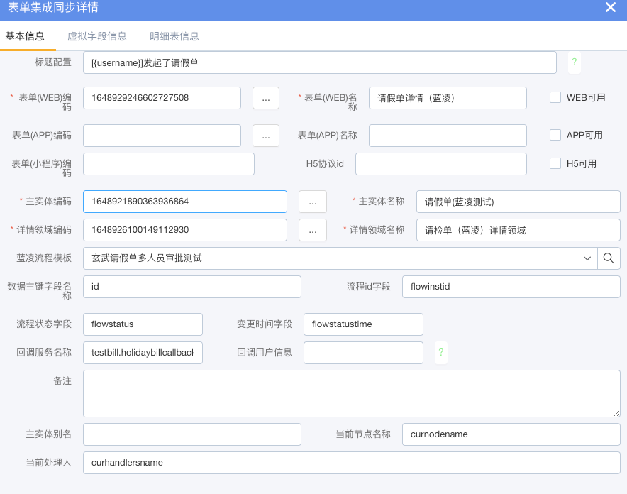
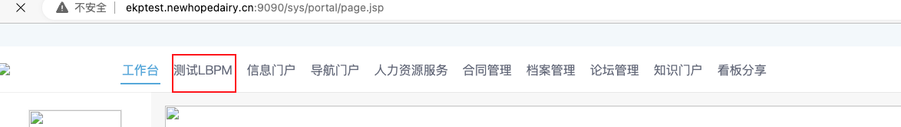
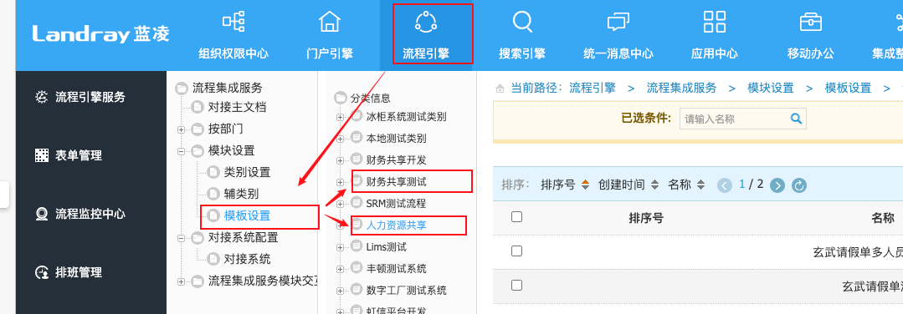
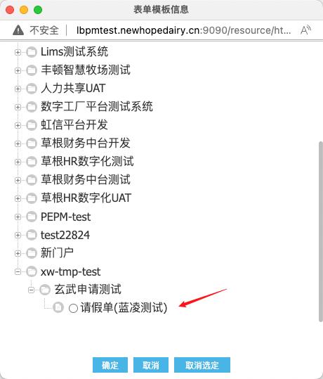
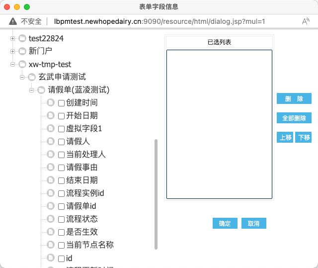
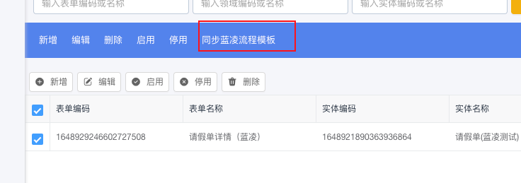
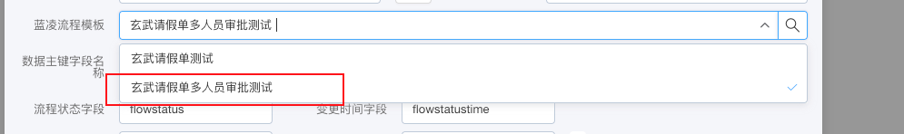
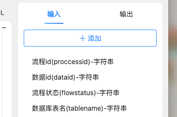
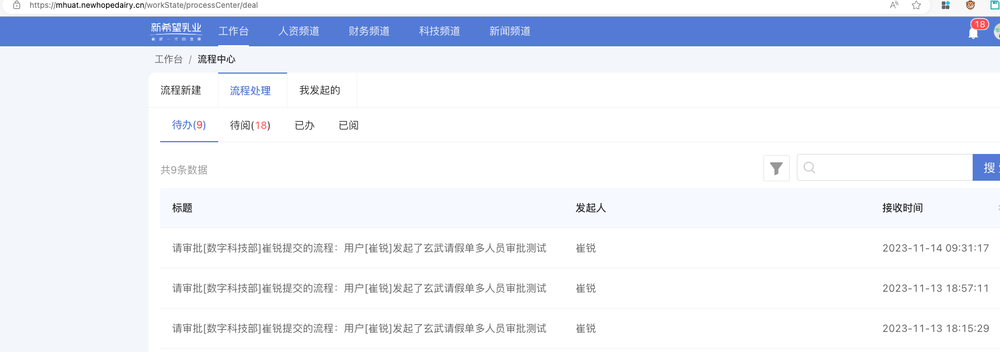
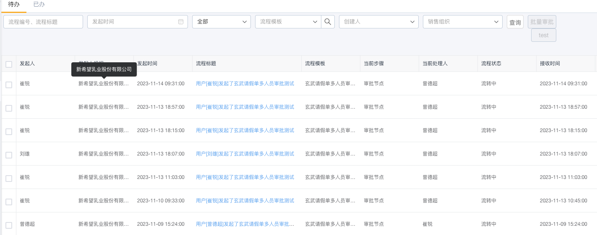

# lbpm集成文档
API地址：https://apifox.com/apidoc/shared-ee0a1010-67dc-401a-96d4-c8a325a19675
> 本文档介绍如何在CRM上集成新希望蓝凌审批流

## 1.流程配置
### 1.表单配置

CRM与LBPM集成需要先在CRM 我的工作->表单集成同步列表中新增同步表单如下如：

新增后在LBPM新增表单的时候就选择这个表单
https://mhuat.newhopedairy.cn/workState
账号：88001044 密码：123qweAS

保存表单成功后点击CRM的同步按钮

再次编辑同步表单,选择刚才创建的表单就此关联完毕

### 2.流程回调设置
业务LBPM是异构系统在审批通过后需要回调CRM业务接口进行相应的审批流程处理
在上一步创建同步表单的时候需要填写回调邻域接口的调用名称也就是`FLY.call(funcNmae,param)`中的第一个参数;
如请假回调接口

名称由所属邻域英文名+行为方法名组成

目前审批流程回调函数有

|Function Name|中文名|flowStatus|
|-|-|-|
|function_pass|通过|10|
|function_reject|驳回|20|
|function_transfer|转办|30|
|function_join|沟通|40|
|function_invalidate|废弃|50|
|function_create_ticket|加签|60|

`回调函数`接受以下参数：
通过`数据id`与`审批状态`进行响应的业务操作

## 2.发起流程
可参考请假审批页面PageCode:1648929246602727508

`发起流程并起草逻辑`

`modellogiccode:1648991867368509529`

::: tip
简单的的来说只需要填写当前流程实例ID即可也就是`forminstanceid`
::: 
1. 流程实例初始化
2. 发起流程(起草)与处理流程同一个接口
3. 本领域主要是发起流程
参数:
- loginName: 不用传入,本领域会自动根据CRM的Token信息获取EPK登录名称(jobnumber)
- forminstanceid: 单据(数据)的主键ID,必填
- #flowtemplateid: (MK)流程模板ID,可以在mk_flowtemplate中获取,可以不填,但是如果这个不填,就必须填写pagecode字段
- #pagecode: CRM系统的UI的PageCode,可以不填写,但是如果不填写,就必须填写flowtemplateid字段
- entitycode: CRM实体定义的code,暂时可以不填写
- subject: 建议填写,如果不填写,本领域会自动生成:xxx发起了yyy流程

--- 
发起后
`新希望页面`

`CRM流程中心`

## 3.审批
相应人员审批

