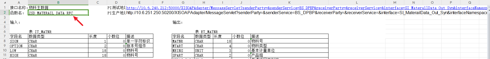

## 新希望 Ws 接口转换 http 调用说明

请求体格式说明

```typescript
interface reqJson {
  url: string; //WebService调用地址
  method: string; //函数名：urn: + 接口函数 如urn:ZSD_MATERAIL_DATA_RFC
  namespace: string; //默认：urn:sap-com:document:sap:rfc:functions
  username: string; // shisiping
  password: string; // 123456
  body: Object; // 对象形式请求体
  timeOut?: number //超时时间（毫秒）非必填默认300秒
}
```



::: tip
Excel 表格中的接口地址为新希望内网环境
需要替换为`119.6.204.184:50100`
:::

调用示例

```js
var reqJson = {
  method: "urn:ZSD_MATERAIL_DATA_RFC",
  username: "shisiping",
  password: "Abcd1234",
  namespace: "urn:sap-com:document:sap:rfc:functions",
  body: {
    IT_ERSDA: {
      item: {
        SIGN: "I",
        OPTION: "BT",
        LOW: "20221001",
        HIGH: "20221031",
      },
    },
    IT_LAEDA: {
      item: {
        SIGN: "I",
        OPTION: "BT",
        LOW: "20221001",
        HIGH: "20221031",
      },
    },
    IT_MTART: {
      item: {
        SIGN: "I",
        OPTION: "EQ",
        LOW: "Z005",
        HIGH: "",
      },
    },
    IT_VKORG: {
      item: {
        SIGN: "I",
        OPTION: "EQ",
        LOW: "4511",
        HIGH: "",
      },
    },
  },
};
var ip_port = "119.6.204.184:50100";
reqJson.url =
  "http:\/\/" +ip_port +"\/XISOAPAdapter\/MessageServlet?senderParty=&senderService=BS_DPBP&receiverParty=&receiverService=&interface=SI_MaterailData_Out_Syn&interfaceNamespace=urn:newhopedairy.cn:dpbp:sd:oubound";
var temp = FLY.call("microservice.wstohttp", reqJson);
FLY.log(temp);
```

成功响应 `"status": "Success"`

```json
{
    "status": "Success",
    "message": "调用成功",
    "body": {
        "ns0:ZSD_MATERAIL_DATA_RFC.Response": {
            "xmlns:ns0": "urn:sap-com:document:sap:rfc:functions",
            "ET_BOM": "",
            "ET_MAKTX": {
                "item": {
                    "MATNR": "000000000050000822",
                    "MAKTX": "新希望(蝶泉)邓川速溶全脂甜奶粉20g*20*20",
                    "PRDHA": 30,
                    "MTART": "Z005",
                    "MEINS": "EA",
                    "MSTAE": ""
                }
            },
            ......省略
        }
    }
}
```

::: danger
失败响应 `"status": "Fault"`
:::

```json
{
  "status": "Fault",
  "message": {
    "faultcode": "SOAP:Server",
    "faultstring": "Server Error",
    "detail": {
      "s:SystemError": {
        "xmlns:s": "http://sap.com/xi/WebService/xi2.0",
        "context": "XIAdapter",
        "code": "ADAPTER.JAVA_EXCEPTION",
        "text": "\ncom.sap.engine.interfaces.messaging.api.exception.MessagingException: com.sap.aii.adapter.xi.routing.RoutingException: InterfaceDetermination did not yield any actual interface\n\tat com.sap.aii.adapter.soap.web.SOAPHandler.processSOAPtoXMB(SOAPHandler.java:746)\n\tat com.sap.aii.adapter.soap.web.MessageServlet.doPost(MessageServlet.java:530)\n\tat javax.servlet.http.HttpServlet.service(HttpServlet.java:754)\n\tat javax.servlet.http.HttpServlet.service(HttpServlet.java:847)\n\tat com.sap.engine.services.servlets_jsp.server.runtime.FilterChainImpl.runServlet(FilterChainImpl.java:202)\n\tat com.sap.engine.services.servlets_jsp.server.runtime.FilterChainImpl.doFilter(FilterChainImpl.java:103)\n\tat com.sap.engine.services.servlets_jsp.server.servlet.AuthenticationFilter.doFilter(AuthenticationFilter.java:126)\n\tat com.sap.engine.services.servlets_jsp.server.runtime.FilterChainImpl.doFilter(FilterChainImpl.java:79)\n\tat com.sap.engine.services.servlets_jsp.server.HttpHandlerImpl.runServlet(HttpHandlerImpl.java:441)\n\tat com.sap.engine.services.servlets_jsp.server.HttpHandlerImpl.handleRequest(HttpHandlerImpl.java:210)\n\tat com.sap.engine.services.httpserver.server.RequestAnalizer.startServlet(RequestAnalizer.java:441)\n\tat com.sap.engine.services.httpserver.server.RequestAnalizer.startServlet(RequestAnalizer.java:430)\n\tat com.sap.engine.services.servlets_jsp.filters.DSRWebContainerFilter.process(DSRWebContainerFilter.java:38)\n\tat com.sap.engine.services.httpserver.chain.AbstractChain.process(AbstractChain.java:78)\n\tat com.sap.engine.services.servlets_jsp.filters.ServletSelector.process(ServletSelector.java:81)\n\tat com.sap.engine.services.httpserver.chain.AbstractChain.process(AbstractChain.java:78)\n\tat com.sap.engine.services.servlets_jsp.filters.ApplicationSelector.process(ApplicationSelector.java:278)\n\tat com.sap.engine.services.httpserver.chain.AbstractChain.process(AbstractChain.java:78)\n\tat com.sap.engine.services.httpserver.filters.WebContainerInvoker.process(WebContainerInvoker.java:81)\n\tat com.sap.engine.services.httpserver.chain.HostFilter.process(HostFilter.java:9)\n\tat com.sap.engine.services.httpserver.chain.AbstractChain.process(AbstractChain.java:78)\n\tat com.sap.engine.services.httpserver.filters.ResponseLogWriter.process(ResponseLogWriter.java:60)\n\tat com.sap.engine.services.httpserver.chain.HostFilter.process(HostFilter.java:9)\n\tat com.sap.engine.services.httpserver.chain.AbstractChain.process(AbstractChain.java:78)\n\tat com.sap.engine.services.httpserver.filters.DefineHostFilter.process(DefineHostFilter.java:27)\n\tat com.sap.engine.services.httpserver.chain.ServerFilter.process(ServerFilter.java:12)\n\tat com.sap.engine.services.httpserver.chain.AbstractChain.process(AbstractChain.java:78)\n\tat com.sap.engine.services.httpserver.filters.MonitoringFilter.process(MonitoringFilter.java:29)\n\tat com.sap.engine.services.httpserver.chain.ServerFilter.process(ServerFilter.java:12)\n\tat com.sap.engine.services.httpserver.chain.AbstractChain.process(AbstractChain.java:78)\n\tat com.sap.engine.services.httpserver.filters.SessionSizeFilter.process(SessionSizeFilter.java:26)\n\tat com.sap.engine.services.httpserver.chain.ServerFilter.process(ServerFilter.java:12)\n\tat com.sap.engine.services.httpserver.chain.AbstractChain.process(AbstractChain.java:78)\n\tat com.sap.engine.services.httpserver.filters.MemoryStatisticFilter.process(MemoryStatisticFilter.java:57)\n\tat com.sap.engine.services.httpserver.chain.ServerFilter.process(ServerFilter.java:12)\n\tat com.sap.engine.services.httpserver.chain.AbstractChain.process(AbstractChain.java:78)\n\tat com.sap.engine.services.httpserver.filters.DSRHttpFilter.process(DSRHttpFilter.java:43)\n\tat com.sap.engine.services.httpserver.chain.ServerFilter.process(ServerFilter.java:12)\n\tat com.sap.engine.services.httpserver.chain.AbstractChain.process(AbstractChain.java:78)\n\tat com.sap.engine.services.httpserver.server.Processor.chainedRequest(Processor.java:475)\n\tat com.sap.engine.services.httpserver.server.Processor$FCAProcessorThread.process(Processor.java:269)\n\tat com.sap.engine.services.httpserver.server.rcm.RequestProcessorThread.run(RequestProcessorThread.java:56)\n\tat com.sap.engine.core.thread.execution.Executable.run(Executable.java:122)\n\tat com.sap.engine.core.thread.execution.Executable.run(Executable.java:101)\n\tat com.sap.engine.core.thread.execution.CentralExecutor$SingleThread.run(CentralExecutor.java:328)\n          "
      }
    }
  },
  "body": null
}
```
